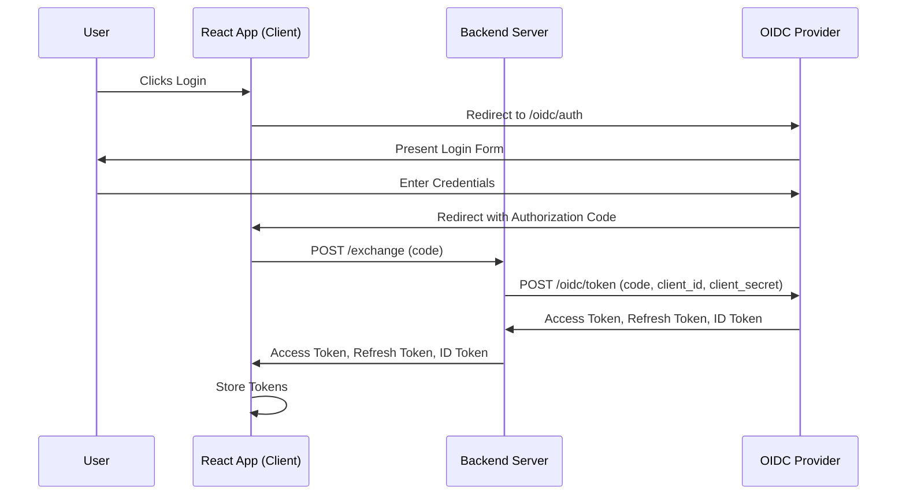
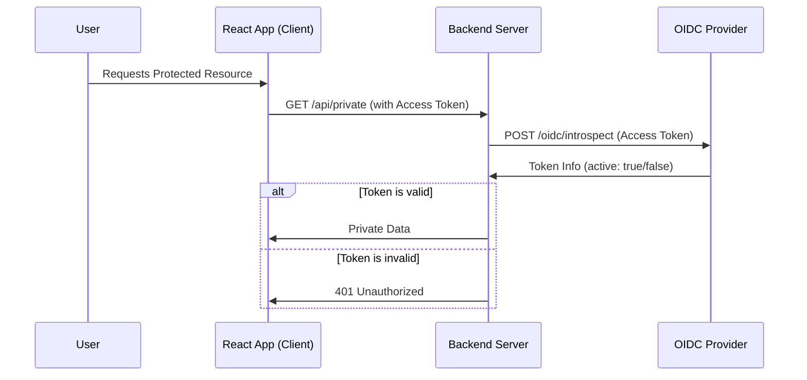
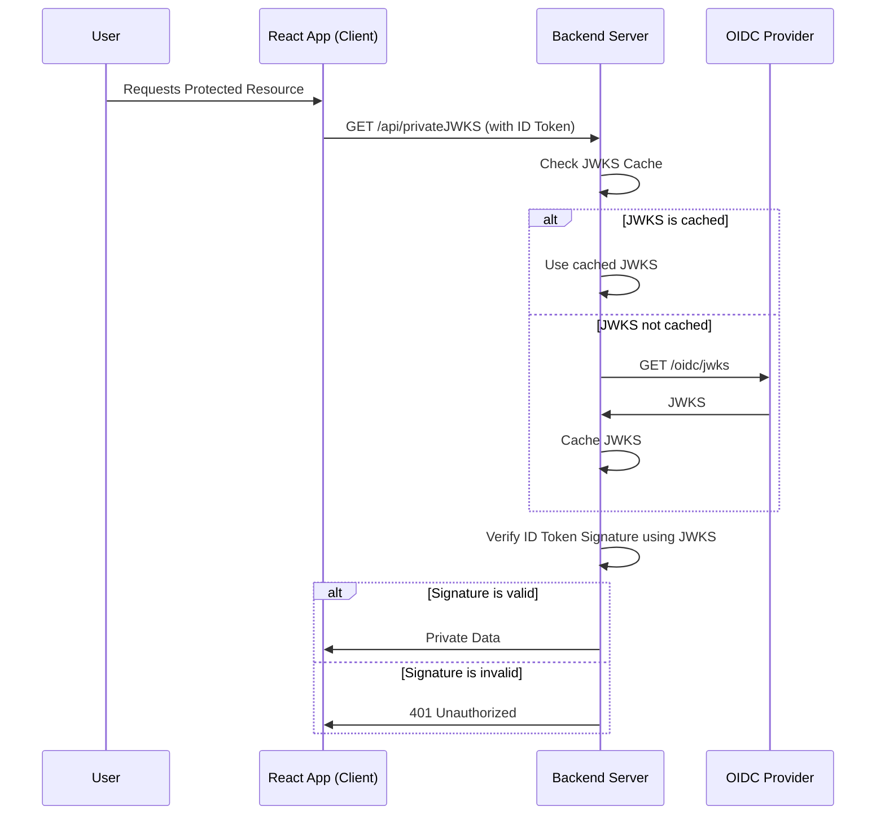
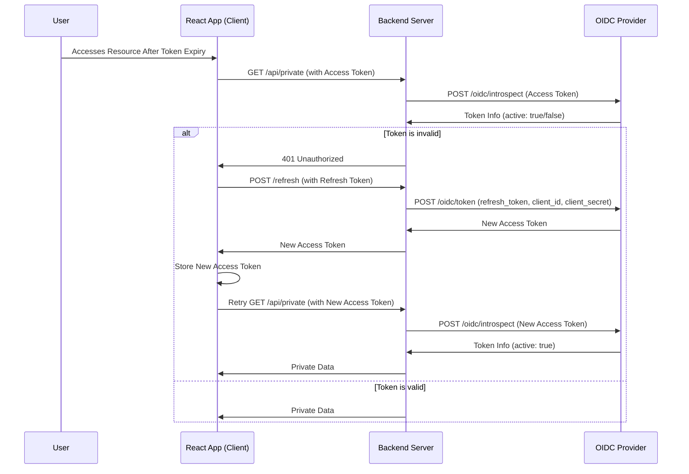

### Diagram 1: Login and Token Exchange

### Diagram 2: Accessing Protected Resources with Introspection Token Verification

### Diagram 3: Accessing Protected Resources with JWKS Token Verification

### Diagram 4: Refresh Token Flow

