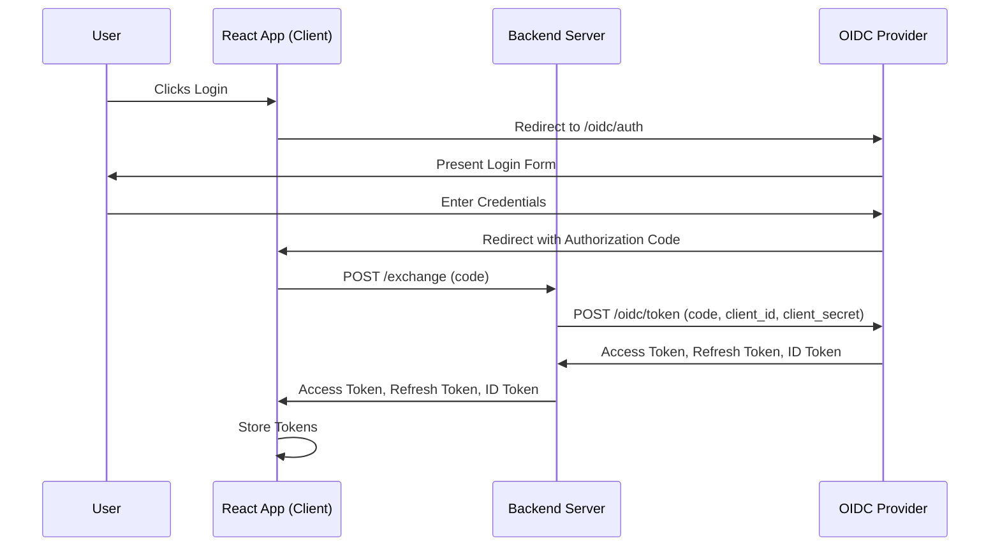
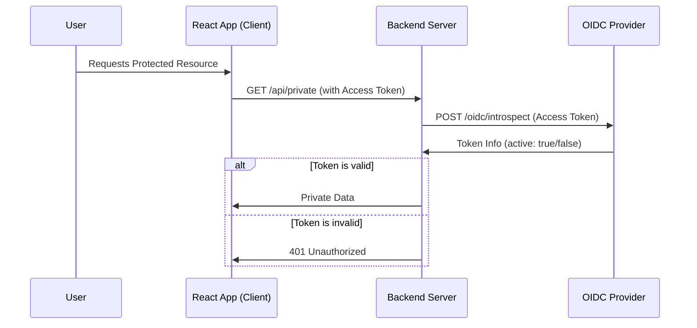
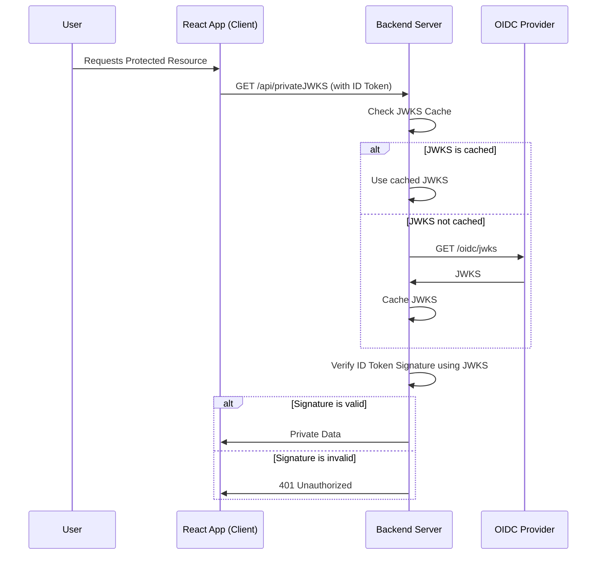
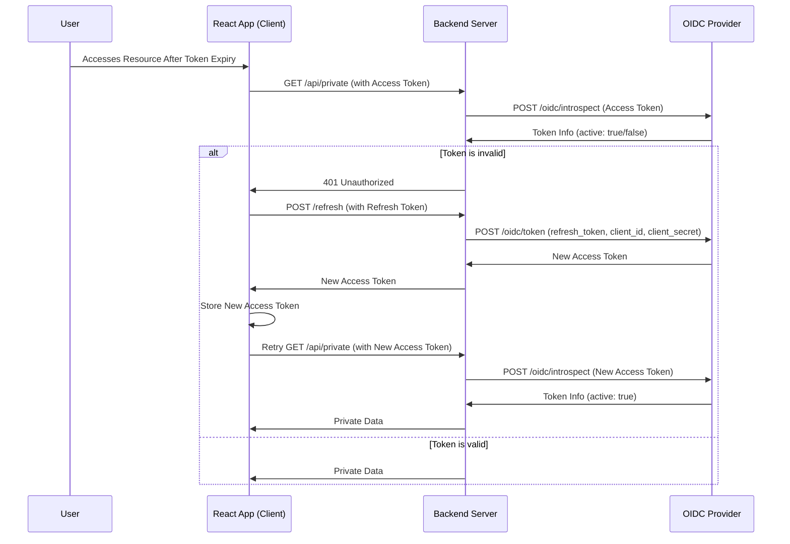
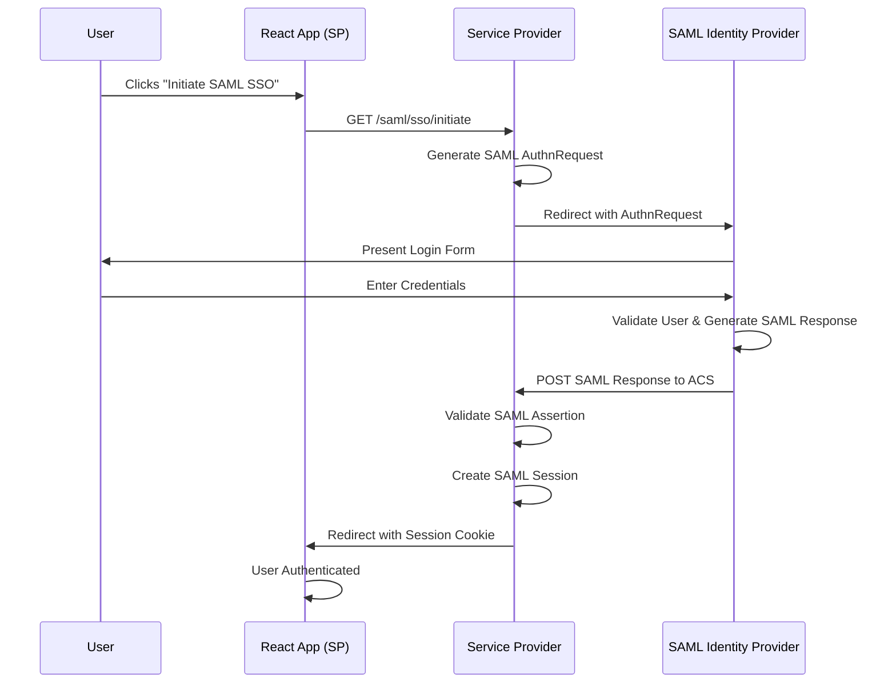
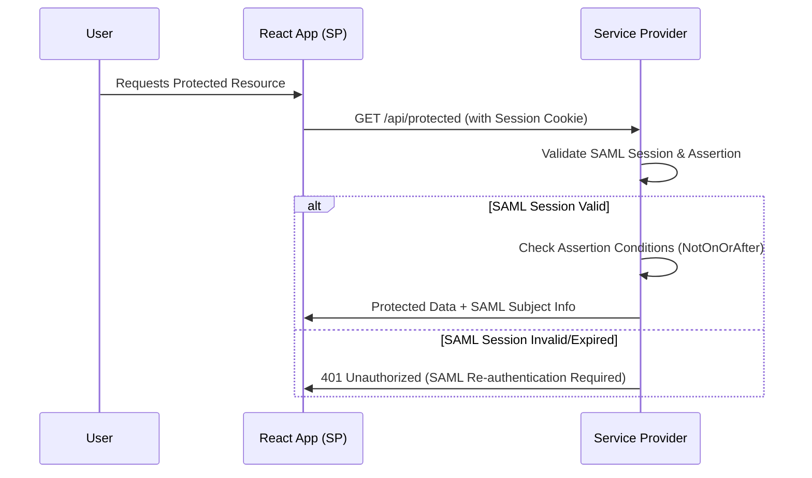
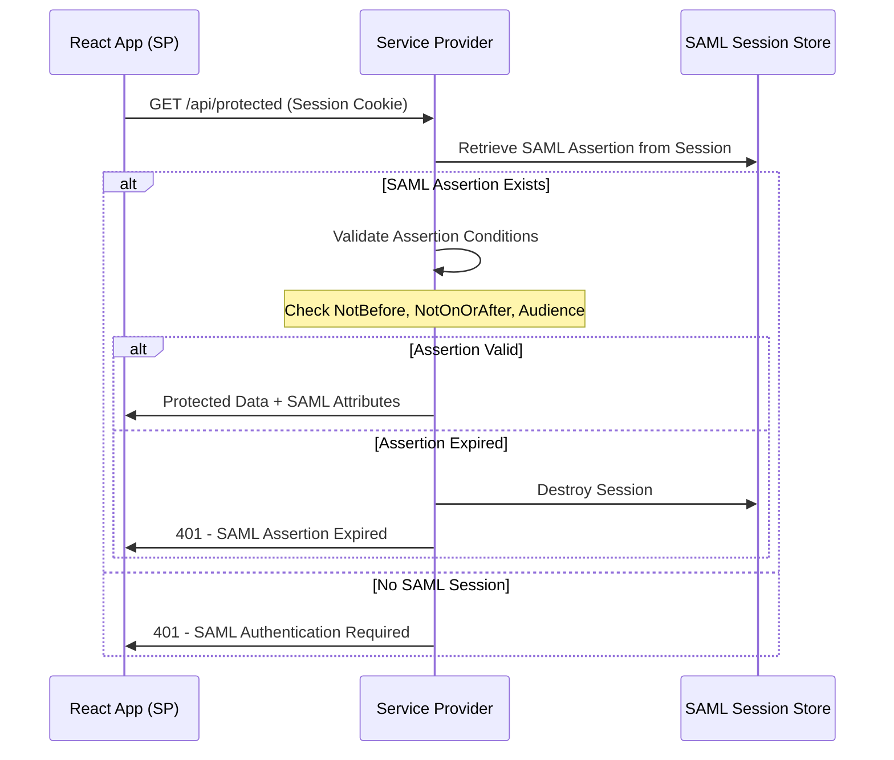
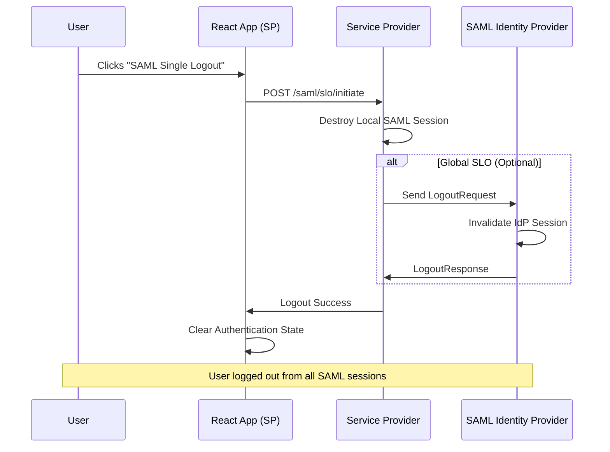

### Diagram 1: Login and Token Exchange



### Diagram 2: Accessing Protected Resources with Introspection Token Verification



### Diagram 3: Accessing Protected Resources with JWKS Token Verification



### Diagram 4: Refresh Token Flow


# 2 frontend (3000,3001), 1 backend 4002, one oidc 4000

sequenceDiagram
    participant User
    participant F1 as App1 Frontend (app1.com)
    participant F2 as App2 Frontend (app2.com)
    participant Backend
    participant OAuth2 as OAuth2 Server
 
    %% App1 Login Flow
    User->>F1: Click "Login" button
    F1->>Backend: GET /login?app=app1
    Backend->>Backend: generate state=rand123, map to app1 redirect_uri
    Backend-->>User: 302 Redirect to OAuth2 /authorize (includes client_id, redirect_uri=app1.com/callback, state=rand123)
    User->>OAuth2: GET /authorize?...&redirect_uri=app1.com/callback&state=rand123
    OAuth2->>User: Login prompt + consent
    User->>OAuth2: Submit credentials
    OAuth2-->>User: 302 Redirect to app1.com/callback?code=xyz&state=rand123
    User->>Backend: GET /oauth/callback?code=xyz&state=rand123
    Backend->>Backend: validate state, retrieve original redirect_uri
    Backend->>OAuth2: POST /token with code, client_id, client_secret
    OAuth2-->>Backend: access_token + refresh_token
    Backend->>Backend: create session, set cookie
    Backend-->>User: Redirect back to app1 or show logged-in page
 
    %% (Same flow applies for App2 with different state + redirect_uri)


    # SAML 2.0 Authentication Demo

This demo showcases SAML 2.0 authentication flows using proper SAML terminology and concepts, parallel to the OAuth2 demo but with SAML-specific flows.

## Architecture

- **Frontend App1**: http://localhost:3002 (React)
- **Frontend App2**: http://localhost:3003 (React) 
- **Service Provider (SP)**: http://localhost:4003 (Express)
- **Identity Provider (IdP)**: http://localhost:4001 (Express)

## SAML 2.0 Flows

### Diagram 1: SAML SSO Authentication Flow (SP-Initiated)



### Diagram 2: Accessing Protected Resources with SAML Session



### Diagram 3: SAML Session Validation Process



### Diagram 4: SAML Single Logout (SLO) Flow



## Key SAML 2.0 Concepts Demonstrated

### 1. **SAML AuthnRequest** (vs OAuth2 Authorization Request)
- SP generates XML-based authentication request
- Contains RequestID, Issuer, ACS URL, NameID Policy
- Sent to IdP via HTTP Redirect binding

### 2. **SAML Response & Assertion** (vs OAuth2 Tokens)
- IdP returns XML-based SAML Response
- Contains digitally signed SAML Assertion
- Assertion includes Subject, Conditions, AttributeStatement, AuthnStatement

### 3. **Assertion Consumer Service (ACS)** (vs OAuth2 Callback)
- SP endpoint that processes SAML Responses
- Validates assertion signature and conditions
- Establishes SAML session based on assertion

### 4. **SAML Session Management** (vs OAuth2 Token Management)
- Session-based authentication using server-side storage
- Session validity tied to SAML assertion conditions
- No refresh tokens - re-authentication required when expired

### 5. **Attribute-Based Authorization**
- SAML assertions contain user attributes
- Attributes used for authorization decisions
- Rich user context available (department, role, etc.)

## Getting Started

```bash
# Install dependencies for all components
cd saml_2 && npm install
cd app2 && npm install  
cd backend && npm install

# Start all services
cd backend && npm run dev:both
cd .. && npm start  # App1 on :3002
cd app2 && npm start # App2 on :3003
```

## Demo Users

- **john@example.com** / password123 (Engineering, Senior Developer)
- **jane@example.com** / password123 (Marketing, Marketing Manager)

## Test Scenarios

1. **SAML SSO Flow**: Initiate login, authenticate at IdP, receive assertion
2. **Protected Resource Access**: Access APIs with valid SAML session
3. **Session Expiration**: Test with expired SAML assertions
4. **Invalid Session**: Test with fake/invalid session cookies
5. **Single Logout**: Terminate all SAML sessions

## SAML vs OAuth2 Comparison

| Aspect | SAML 2.0 | OAuth2/OIDC |
|--------|----------|-------------|
| **Protocol Type** | XML-based | JSON/HTTP-based |
| **Primary Use Case** | Enterprise SSO | API Authorization + SSO |
| **Token Format** | XML Assertions | JWT/Opaque Tokens |
| **Session Model** | Server-side sessions | Stateless tokens |
| **Binding Methods** | HTTP-POST, HTTP-Redirect | HTTP redirects, JSON APIs |
| **Metadata** | XML metadata exchange | JSON discovery documents |
| **Logout** | Single Logout (SLO) | Token revocation |
| **Attribute Sharing** | Rich attribute statements | Claims in ID tokens |
