### Diagram 1: Login and Token Exchange


### Diagram 2: Accessing Protected Resources with Introspection Token Verification


### Diagram 3: Accessing Protected Resources with JWKS Token Verification


### Diagram 4: Refresh Token Flow


# 2 frontend (3000,3001), 1 backend 4002, one oidc 4000

sequenceDiagram
    participant User
    participant F1 as App1 Frontend (app1.com)
    participant F2 as App2 Frontend (app2.com)
    participant Backend
    participant OAuth2 as OAuth2 Server
 
    %% App1 Login Flow
    User->>F1: Click "Login" button
    F1->>Backend: GET /login?app=app1
    Backend->>Backend: generate state=rand123, map to app1 redirect_uri
    Backend-->>User: 302 Redirect to OAuth2 /authorize (includes client_id, redirect_uri=app1.com/callback, state=rand123)
    User->>OAuth2: GET /authorize?...&redirect_uri=app1.com/callback&state=rand123
    OAuth2->>User: Login prompt + consent
    User->>OAuth2: Submit credentials
    OAuth2-->>User: 302 Redirect to app1.com/callback?code=xyz&state=rand123
    User->>Backend: GET /oauth/callback?code=xyz&state=rand123
    Backend->>Backend: validate state, retrieve original redirect_uri
    Backend->>OAuth2: POST /token with code, client_id, client_secret
    OAuth2-->>Backend: access_token + refresh_token
    Backend->>Backend: create session, set cookie
    Backend-->>User: Redirect back to app1 or show logged-in page
 
    %% (Same flow applies for App2 with different state + redirect_uri)


# SAML 2.0 Authentication Demo

This demo showcases a complete SAML 2.0 authentication system with **Single Sign-On (SSO)** and **Single Logout (SLO)** functionality. Login once to access both applications, logout once to terminate all sessions.

## 🏗️ Architecture

- **Frontend App 3**: http://localhost:4003 (React) - Advanced Analytics
- **Frontend App 4**: http://localhost:4004 (React) - Business Dashboard  
- **Service Provider (SP)**: http://localhost:4001 (Express.js)
- **Identity Provider (IdP)**: http://localhost:4002 (Express.js)

## ✨ Key Features

### 🔐 Single Sign-On (SSO)
- **Login once, access everywhere**: Authenticate with the IdP and gain access to both applications
- **Session sharing**: SAML session is shared across all Service Provider applications
- **Seamless experience**: No need to login separately to each app

### 🚪 Single Logout (SLO) 
- **Global logout**: Logout from one app terminates sessions in ALL applications
- **Complete session termination**: Clears both IdP and SP sessions
- **Automatic redirection**: After logout, users are redirected to a confirmation page

### 🛡️ Security Features
- Session-based authentication with SAML assertions
- Attribute-based user information sharing
- Protected API endpoints requiring valid SAML sessions
- Session expiration handling (30 minutes)

## 📊 SAML 2.0 Flow Diagrams

### Diagram 1: SAML SSO Authentication Flow (SP-Initiated)

```mermaid
sequenceDiagram
    participant User
    participant App3 as App 3 Frontend
    participant App4 as App 4 Frontend
    participant SP as Service Provider
    participant IdP as SAML Identity Provider

    User->>App3: Clicks "🚀 Login with SAML"
    App3->>SP: GET /sp/sso/initiate?app=app3&returnUrl=...
    SP->>SP: Generate SAML AuthnRequest + RelayState
    SP->>IdP: POST SAMLRequest (HTTP-POST Binding)
    IdP->>User: Present Login Form
    User->>IdP: Enter Credentials (john@example.com)
    IdP->>IdP: Validate User & Generate SAML Response
    IdP->>SP: POST SAML Response to ACS (/sp/acs)
    SP->>SP: Validate SAML Assertion & Create Session
    SP->>App3: HTTP 302 Redirect to App3
    App3->>App3: ✅ User Authenticated
    
    Note over User,IdP: 🎉 SSO Complete! User can now access App4 without re-authentication
    
    User->>App4: Navigate to App 4
    App4->>SP: GET /sp/session/status
    SP->>App4: { authenticated: true, assertion: {...} }
    App4->>App4: ✅ Already Authenticated (SSO!)
```



### Diagram 2: Cross-Application SSO (Login Once, Access Both)

```mermaid
sequenceDiagram
    participant User
    participant App3 as App 3 (Analytics)
    participant App4 as App 4 (Dashboard)
    participant SP as Service Provider
    participant IdP as Identity Provider

    Note over User,IdP: User starts at App 3
    User->>App3: Access App 3
    App3->>SP: Check session status
    SP->>App3: Not authenticated
    User->>App3: Click "Login with SAML"
    
    rect rgb(200, 255, 200)
        Note over User,IdP: SAML Authentication (First Time)
        App3->>SP: Initiate SAML SSO
        SP->>IdP: SAML AuthnRequest
        IdP->>User: Login form
        User->>IdP: Provide credentials
        IdP->>SP: SAML Response
        SP->>SP: Create session
        SP->>App3: Redirect back
    end
    
    App3->>App3: ✅ Authenticated
    
    Note over User,IdP: User switches to App 4 (SSO Magic!)
    User->>App4: Access App 4
    App4->>SP: Check session status
    SP->>App4: ✅ Already authenticated!
    App4->>App4: ✅ Automatically logged in (No re-authentication needed)
    
    User->>App4: Fetch private data
    App4->>SP: GET /api/protected/app4
    SP->>App4: ✅ Protected data returned
```



### Diagram 3: SAML Single Logout Flow (Logout Once, All Apps Die)

```mermaid
sequenceDiagram
    participant User
    participant App3 as App 3
    participant App4 as App 4  
    participant SP as Service Provider
    participant IdP as Identity Provider

    Note over User,IdP: User authenticated in both apps
    App3->>App3: ✅ Authenticated
    App4->>App4: ✅ Authenticated
    
    User->>App3: Click "🔐 SAML Single Logout"
    App3->>SP: GET /sp/slo/initiate
    SP->>SP: Generate SAML LogoutRequest
    SP->>IdP: GET /idp/slo (SAMLRequest)
    IdP->>IdP: Clear IdP session
    IdP->>IdP: Generate SAML LogoutResponse  
    IdP->>SP: POST /sp/slo (SAMLResponse)
    SP->>SP: Clear SP session
    SP->>User: Show logout success page
    
    Note over User,IdP: 🚨 Global logout effect
    User->>App4: Try to access App 4
    App4->>SP: Check session status
    SP->>App4: ❌ Not authenticated (session destroyed)
    App4->>App4: ❌ User logged out
    
    User->>App3: Try to fetch protected data
    App3->>SP: GET /api/protected/app3
    SP->>App3: ❌ 401 Unauthorized (session destroyed)
```



### Diagram 4: Session Validation and Expiration

```mermaid
sequenceDiagram
    participant User
    participant Frontend as React App
    participant SP as Service Provider
    
    User->>Frontend: Access protected resource
    Frontend->>SP: GET /api/protected/app3 (with cookies)
    SP->>SP: Check session.loggedIn
    
    alt Session exists and valid
        SP->>SP: Check assertion.validUntil (30 min)
        alt Session not expired  
            SP->>Frontend: ✅ Protected data + user attributes
        else Session expired
            SP->>SP: Destroy session
            SP->>Frontend: ❌ 401 - Session expired, please re-authenticate
        end
    else No session
        SP->>Frontend: ❌ 401 - Authentication required
        Frontend->>SP: Redirect to /sp/sso/initiate
    end
```



## 🚀 Getting Started

### Prerequisites
```bash
node >= 16.x
npm >= 8.x
```

### Installation & Startup

```bash
# 1. Install dependencies for all components
cd saml_2/backend && npm install
cd ../app3 && npm install  
cd ../app4 && npm install

# 2. Start Identity Provider (Terminal 1)
cd saml_2/backend
node saml-identity-provider.js
# 🔐 SAML Identity Provider running on http://localhost:4002

# 3. Start Service Provider (Terminal 2)  
node server.js
# 🔐 SAML Service Provider running on http://localhost:4001

# 4. Start App 3 (Terminal 3)
cd ../app3
npm start
# App 3 running on http://localhost:4003

# 5. Start App 4 (Terminal 4)
cd ../app4  
npm start
# App 4 running on http://localhost:4004
```

## 👥 Demo Users

| Email | Password | Full Name | Title |
|-------|----------|-----------|-------|
| `john@example.com` | `password123` | John Doe | Senior Developer |
| `test@example.com` | `password` | Test User | Test User |

## 🔧 API Endpoints

### Service Provider (SP) - Port 4001

| Method | Endpoint | Description |
|--------|----------|-------------|
| `GET` | `/sp/metadata` | SP metadata (XML) |
| `GET` | `/sp/sso/initiate` | Initiate SAML login |
| `POST` | `/sp/acs` | Assertion Consumer Service |
| `GET` | `/sp/session/status` | Check authentication status |
| `GET` | `/sp/slo/initiate` | Initiate Single Logout |
| `POST` | `/sp/slo` | Handle logout responses |
| `GET` | `/api/protected/app3` | Protected data for App 3 |
| `GET` | `/api/protected/app4` | Protected data for App 4 |

### Identity Provider (IdP) - Port 4002

| Method | Endpoint | Description |
|--------|----------|-------------|
| `GET` | `/idp/metadata` | IdP metadata (XML) |
| `GET` | `/idp/sso` | SSO endpoint (GET/POST) |
| `POST` | `/idp/authenticate` | Process user authentication |
| `GET` | `/idp/slo` | Single Logout endpoint |
| `GET` | `/idp/status` | Service status |

## 🧪 Testing Scenarios

### Scenario 1: Single Sign-On (SSO)
1. **Start**: Open App 3 (http://localhost:4003) - not authenticated
2. **Login**: Click "🚀 Login with SAML" 
3. **Authenticate**: Login with `john@example.com` / `password123`
4. **App 3 Access**: Fetch private data successfully
5. **SSO Test**: Open App 4 (http://localhost:4004) in new tab
6. **Verify**: App 4 should show "✅ SAML Authenticated" immediately
7. **Cross-access**: Fetch private data from App 4 without re-authentication

### Scenario 2: Single Logout (SLO)
1. **Setup**: Login and access both App 3 and App 4
2. **Logout**: From any app, click "🔐 SAML Single Logout"
3. **IdP Processing**: Redirected through IdP logout process
4. **Confirmation**: See logout success page
5. **Verify Global Logout**: 
   - Refresh App 3 → Should show login button
   - Refresh App 4 → Should show login button
   - Try accessing protected endpoints → Should return 401

### Scenario 3: Session Expiration
1. **Login**: Authenticate successfully
2. **Wait**: Wait 30+ minutes (or modify server timeout for testing)
3. **Access**: Try to fetch protected data
4. **Result**: Should show "Session expired, please re-authenticate"

### Scenario 4: Security Testing
1. **Fake Token Test**: Click "🔍 Test with Fake Token"
2. **Result**: Should show rejection message
3. **Direct API Access**: Try accessing protected endpoints without authentication
4. **Result**: Should return 401 with login URL

## 🔍 SAML Attributes Received

The IdP provides these user attributes in SAML assertions:

| SAML Attribute OID | Friendly Name | Example Value |
|-------------------|---------------|---------------|
| `urn:oid:1.3.6.1.4.1.5923.1.1.1.6` | email | john@example.com |
| `urn:oid:2.5.4.3` | cn (Common Name) | John Doe |
| `urn:oid:2.5.4.4` | sn (Surname) | Doe |
| `urn:oid:2.5.4.42` | givenName | John |
| `urn:oid:0.9.2342.19200300.100.1.3` | mail | john@example.com |
| `urn:oid:2.5.4.12` | title | Senior Developer |

## 🔒 Session Management

### Session Duration
- **SP Session**: 24 hours (configurable)
- **SAML Assertion Validity**: 30 minutes (configurable)
- **IdP Session**: 24 hours (configurable)

### Session Data Structure
```json
{
  "authenticated": true,
  "authMethod": "saml",
  "assertion": {
    "subject": "john@example.com",
    "attributes": {
      "email": "john@example.com",
      "givenName": "John",
      "cn": "John Doe",
      "title": "Senior Developer"
    },
    "sessionIndex": "_uuid-here",
    "timestamp": "2024-01-01T12:00:00.000Z",
    "validUntil": "2024-01-01T12:30:00.000Z"
  }
}
```

## 🛠️ Troubleshooting

### Common Issues

#### "App 4 redirects to App 3 after login"
- **Cause**: Backend defaulting to wrong app
- **Fix**: Updated server.js to use RelayState properly
- **Verify**: Check console logs for RelayState parsing

#### "Session not found / undefined"
- **Cause**: Cookie not being sent with requests
- **Fix**: Ensure `withCredentials: true` in all axios requests
- **Check**: Verify CORS settings allow credentials

#### "SAML Single Logout fails"
- **Cause**: Session handling issues in IdP
- **Fix**: Updated IdP to handle session safely
- **Debug**: Check IdP console logs for errors

#### "No active SAML session" 
- **Cause**: Session expired or not created
- **Fix**: Check session timeout settings
- **Verify**: Use `/sp/session/status` endpoint to debug

### Debug Commands

```bash
# Check if all services are running
curl http://localhost:4001/
curl http://localhost:4002/

# Check SAML metadata
curl http://localhost:4001/sp/metadata
curl http://localhost:4002/idp/metadata

# Check session status (with cookies)
curl -b cookies.txt http://localhost:4001/sp/session/status
```

## 📝 Implementation Notes

### SAML vs OAuth2 Comparison

| Aspect | SAML 2.0 (This Demo) | OAuth2/OIDC |
|--------|----------------------|-------------|
| **Protocol Type** | XML-based | JSON/HTTP-based |
| **Primary Use Case** | Enterprise SSO | API Authorization + SSO |
| **Token Format** | XML Assertions | JWT/Opaque Tokens |
| **Session Model** | Server-side sessions | Stateless tokens |
| **Binding Methods** | HTTP-POST, HTTP-Redirect | HTTP redirects, JSON APIs |
| **Metadata** | XML metadata exchange | JSON discovery documents |
| **Logout** | Single Logout (SLO) | Token revocation |
| **Attribute Sharing** | Rich attribute statements | Claims in ID tokens |
| **Complexity** | Higher (XML parsing) | Lower (JSON) |
| **Enterprise Adoption** | Very high | Growing |
| **Mobile/SPA Support** | Limited | Excellent |

### Key SAML Concepts Demonstrated

#### 1. **SAML AuthnRequest** (Authentication Request)
- SP generates XML-based authentication request
- Contains RequestID, Issuer, ACS URL, NameID Policy
- Sent to IdP via HTTP-POST or HTTP-Redirect binding

#### 2. **SAML Response & Assertion**
- IdP returns XML-based SAML Response
- Contains digitally signed SAML Assertion (in this demo, unsigned for simplicity)
- Assertion includes:
  - **Subject**: User identifier (NameID)
  - **Conditions**: Validity timeframe, audience restrictions
  - **AttributeStatement**: User attributes (name, email, title, etc.)
  - **AuthnStatement**: Authentication method and time

#### 3. **Assertion Consumer Service (ACS)**
- SP endpoint that processes SAML Responses (`/sp/acs`)
- Validates assertion signature and conditions (simplified validation in demo)
- Establishes SAML session based on assertion

#### 4. **RelayState Management**
- Maintains application context during authentication flow
- Ensures users return to the correct application after login
- Format: `{"app": "app3", "returnUrl": "http://localhost:4003"}`

#### 5. **Single Logout (SLO)**
- Terminates sessions across all applications
- Uses SAML LogoutRequest/LogoutResponse messages
- Supports both SP-initiated and IdP-initiated logout

## 🏗️ Architecture Details

### Authentication Flow Details

1. **Initial Access**:
   ```
   User → App 3/4 → SP (/sp/session/status) → Not authenticated
   ```

2. **SAML SSO Initiation**:
   ```
   App → SP (/sp/sso/initiate) → Generate AuthnRequest → Redirect to IdP
   ```

3. **IdP Authentication**:
   ```
   IdP → Present login form → Validate credentials → Generate SAML Response
   ```

4. **Assertion Processing**:
   ```
   IdP → POST to SP (/sp/acs) → Validate assertion → Create session → Redirect to app
   ```

5. **Subsequent Access (SSO)**:
   ```
   User → Other App → SP → Valid session exists → Immediate access
   ```

### Session Architecture

```
┌─────────────┐    ┌─────────────────┐    ┌─────────────┐
│   App 3     │    │  Service        │    │    IdP      │
│ :4003       │◄──►│  Provider       │◄──►│ :4002       │
└─────────────┘    │  :4001          │    └─────────────┘
                   │                 │            
┌─────────────┐    │  - Sessions     │    - User DB    
│   App 4     │◄──►│  - SAML logic   │    - AuthnReq   
│ :4004       │    │  - Protected    │    - SAML Resp  
└─────────────┘    │    endpoints    │    - Logout     
                   └─────────────────┘                 
```

## 🔐 Security Considerations

### What's Implemented
✅ Session-based authentication
✅ SAML assertion validation (basic)
✅ Audience restriction checking
✅ Session timeout (30 minutes)
✅ CORS protection
✅ RelayState validation
✅ Single Logout support

### Production Considerations (Not Implemented in Demo)
❌ **SAML Assertion Signing**: Real implementations should sign assertions
❌ **Certificate Management**: Use proper X.509 certificates
❌ **Assertion Encryption**: Encrypt sensitive assertions
❌ **Request Signing**: Sign AuthnRequests for security
❌ **HTTPS Only**: All communication should use HTTPS
❌ **Input Validation**: Comprehensive XML validation
❌ **Rate Limiting**: Prevent brute force attacks
❌ **Session Security**: Secure session storage
❌ **Audit Logging**: Log all authentication events

### Demo Security Notes
⚠️ **This is a demonstration**: Not production-ready
⚠️ **HTTP used**: Production should use HTTPS only
⚠️ **No signature validation**: Assertions are not cryptographically verified
⚠️ **Simple session store**: Use Redis/database in production
⚠️ **Basic validation**: Implement comprehensive SAML validation

## 📊 Monitoring & Observability

### Key Metrics to Monitor
- Authentication success/failure rates
- Session creation/destruction events
- SAML assertion validation errors
- Cross-application access patterns
- Logout completion rates

### Log Examples

```javascript
// Successful authentication
console.log('✅ SAML Response parsed successfully');
console.log('📋 NameID:', nameId);
console.log('📋 Attributes:', JSON.stringify(attributes, null, 2));

// Session validation
console.log('🔍 Session status check');
console.log('Session logged in:', req.session.loggedIn);

// Single logout
console.log('🚪 Initiating SAML Single Logout...');
console.log('✅ Logout successful according to IdP');
```

## 🧩 Extending the Demo

### Adding More Applications
1. Create new React app on different port
2. Add new protected endpoint in SP: `/api/protected/app5`
3. Update CORS settings to include new origin
4. Configure RelayState handling for new app

### Adding User Roles/Authorization
```javascript
// In SP protected endpoints
const userRole = req.session.attributes?.role;
if (userRole !== 'admin') {
    return res.status(403).json({ error: 'Insufficient privileges' });
}
```

### Adding IdP-Initiated SSO
```javascript
// New IdP endpoint for direct login links
app.get('/idp/sso/initiate/:targetApp', (req, res) => {
    const targetApp = req.params.targetApp;
    // Generate unsolicited SAML response
    // Redirect to appropriate SP
});
```

### Database Integration
```javascript
// Replace in-memory users with database
const users = await db.users.findOne({ email: email });
if (users && await bcrypt.compare(password, users.hashedPassword)) {
    // Proceed with SAML response generation
}
```

## 🎯 Use Cases

### Enterprise SSO
- **Scenario**: Large company with multiple internal applications
- **Benefit**: Employees login once, access all authorized applications
- **Implementation**: Central IdP (Active Directory/LDAP integration)

### Partner Integration
- **Scenario**: B2B integration where partners need access to specific applications
- **Benefit**: Partners use their own credentials, no separate account management
- **Implementation**: Federated IdP trust relationships

### SaaS Application Suite
- **Scenario**: Software vendor with multiple SaaS products
- **Benefit**: Customers get seamless experience across product suite
- **Implementation**: Centralized identity service across products

## 📚 Further Reading

### SAML 2.0 Specifications
- [SAML 2.0 Core Specification](https://docs.oasis-open.org/security/saml/v2.0/saml-core-2.0-os.pdf)
- [SAML 2.0 Bindings](https://docs.oasis-open.org/security/saml/v2.0/saml-bindings-2.0-os.pdf)
- [SAML 2.0 Profiles](https://docs.oasis-open.org/security/saml/v2.0/saml-profiles-2.0-os.pdf)

### Best Practices
- [SAML Security Guidelines](https://docs.oasis-open.org/security/saml/v2.0/saml-sec-consider-2.0-os.pdf)
- [OWASP SAML Security Cheat Sheet](https://cheatsheetseries.owasp.org/cheatsheets/SAML_Security_Cheat_Sheet.html)

### Related Technologies
- [OAuth 2.0 vs SAML](https://auth0.com/blog/saml-vs-oauth/)
- [OpenID Connect](https://openid.net/connect/)
- [JSON Web Tokens (JWT)](https://jwt.io/)

## 🤝 Contributing

### Development Setup
```bash
# Install all dependencies
npm run install:all

# Start all services in development mode
npm run dev:all

# Run tests
npm test

# Lint code
npm run lint
```

### Code Structure
```
saml_2/
├── backend/
│   ├── server.js              # Service Provider (SP)
│   └── saml-identity-provider.js  # Identity Provider (IdP)
├── app3/                      # React App 3
│   └── src/App.jsx
├── app4/                      # React App 4
│   └── src/App.jsx
└── tests/
    └── saml-success-flow-e2e.spec.ts  # E2E tests
```

## 📄 License

This demo is provided for educational purposes. Use at your own risk.

---

## 🎉 Demo Summary

This SAML 2.0 demo showcases:

✅ **Complete SSO Experience**: Login once, access both applications seamlessly
✅ **Global Logout**: Logout once, terminates all application sessions  
✅ **Realistic SAML Flow**: Proper AuthnRequest/Response cycle with RelayState
✅ **User Attributes**: Rich user information sharing via SAML assertions
✅ **Session Management**: Robust session handling with expiration
✅ **Security Features**: Protected endpoints, session validation, CORS
✅ **Multiple Applications**: Two distinct React applications with shared authentication
✅ **Error Handling**: Comprehensive error scenarios and user feedback

**Perfect for**: Learning SAML concepts, prototyping enterprise SSO, understanding federation patterns

**Next Steps**: Add signature validation, implement HTTPS, integrate with real IdP (Active Directory, Auth0, etc.)

**Happy SAML-ing!** 🚀

## 🎯 RelayState-based Auto Redirect

### Configuration
- **Official Registration**: Only `localhost:4003` is registered with IdP
- **Multi-App Support**: Both App3 and App4 supported via RelayState
- **Auto Redirect**: Users automatically redirected to originating app after login

### How It Works

1. **User initiates login** from any app (3 or 4)
2. **RelayState created** with app info and return URL:
   ```json
   {
     "app": "app4",
     "returnUrl": "http://localhost:4004",
     "targetDomain": "http://localhost:4004",
     "requestId": "_uuid-here",
     "timestamp": 1234567890
   }
   ```
3. **IdP receives request** and shows which app initiated login
4. **After authentication**, IdP generates SAML Response
5. **SP processes response** and reads RelayState
6. **Auto-redirect** to correct app based on RelayState

### Benefits
- ✅ **Single Registration**: Only one domain registered with IdP
- ✅ **Multiple Apps**: Support unlimited applications
- ✅ **Seamless UX**: Users always return to originating app
- ✅ **Flexible Routing**: Easy to add new applications
- ✅ **Security**: Validates redirect URLs against whitelist

### RelayState Structure
```javascript
// Generated by SP during SSO initiation
{
  "app": "app3|app4",           // Application identifier
  "returnUrl": "http://...",    // Exact return URL
  "targetDomain": "http://...", // Fallback domain
  "requestId": "_uuid",         // SAML request ID
  "timestamp": 1234567890       // Creation timestamp
}
```

### Adding New Applications
1. **No IdP changes needed** - RelayState handles routing
2. **Add CORS origin** to SP configuration
3. **Add protected endpoint** for new app
4. **Update redirect logic** in ACS handler

This pattern allows you to support unlimited applications while maintaining a single registered domain with your Identity Provider!
